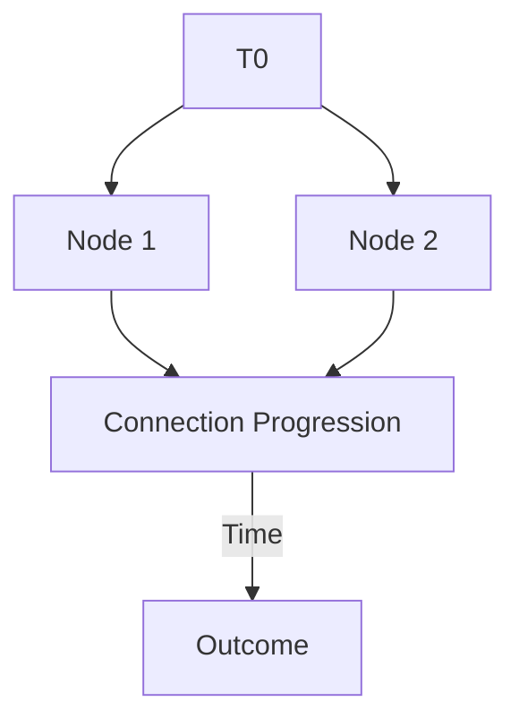
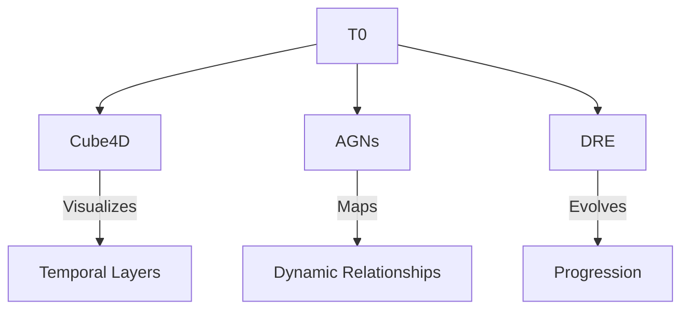

### **Markdown File: `T0_Node.md`**

# T0: The First Node

## The Beginning of Connection

The **T0 Node** represents the **first moment**, the **first vibration**, the **first relationship**. It is the **root** of the graph, the **anchor** of the symphony, the **origin of time and space**.

---

### Characteristics of T0

- **n**: The first value, undefined yet foundational. It carries the potential for all.
- **Boundary**: Encased in the simplest structure—a circle, representing unity and infinite potential.

---

### Relationship to Other Nodes

From T0 stems:
- Temporal Nodes (T1, T2…): Representing progression in time.
- Structural Nodes: Representing the framework.
- Dynamic Nodes: Representing adaptability.

---

### The Sound of T0

Like the **first note** in a symphony, T0 **initiates the rhythm**:
- It defines a starting point.
- It creates a **pulse**.
- It invites the next.

---

### The Philosophy Behind T0

**T0 is timeless yet momentary.** It is a paradox, a state of both being and becoming. Without it, no connection can exist; with it, the symphony begins.

---
# T0: The First Node of Singularity

In the beginning, there was **T0**. The first node. The first connection. The point where the static became dynamic, where existence found its shape, and where time began to flow.

---

## 🌀 What is T0?

**T0** is more than a starting point—it’s the **defining moment** that connects everything:
- It marks the **origin of time** in the system, the temporal domain from which all relationships evolve.
- It creates the **first edge**, turning isolation into interaction, static into dynamic.
- It defines the **shape** of connection—both its geometry and its progression.

---

## 📐 The Shape of Connection

The structure of **T0** embodies the essence of Singularity:
1. **Node**: A concept, an entity, or a moment—raw potential.
2. **Edge**: The relationship that connects nodes—dynamic and evolving.
3. **Temporal Domain**: The progression of connection over time.

### Diagram: T0 as the Beginning

*The temporal domain evolves as relationships form and progress.*

---

## 🌟 The Core Principles of T0

1. **It Defines the Start**:  
   T0 is the anchor point, the foundation of all progression. Every node and every edge traces its lineage back to this moment.

2. **It Shapes Connection**:  
   The geometry of T0 influences how relationships unfold, determining the structure of the graph.

3. **It Creates the Temporal Layer**:  
   Time is inherent to T0, giving connections the ability to grow, evolve, and adapt.

---

## 🧩 Building on T0

**T0** is the root of the ecosystem, but it doesn’t act alone. It supports the frameworks that expand its principles into real-world applications.

### The Ecosystem Expands
1. **Cube4D**:  
   T0 introduces the temporal layer, and Cube4D visualizes it across dimensions.
2. **Active Graph Networks (AGNs)**:  
   T0 defines the first relationships, creating the foundation for dynamic graphs.
3. **Dynamic Relationship Expansion (DRE)**:  
   T0 sets the stage for relationships to evolve and adapt over time.

### Diagram: T0 in the Ecosystem

*From T0, the ecosystem grows and evolves.*

---

## 🎵 T0: The First Note of the Symphony

Every great symphony begins with a single note. **T0** is that note—the moment where silence turns into sound, where potential turns into creation.

- **T0 is the origin of time.**
- **T0 is the shape of connection.**
- **T0 is the foundation of progression.**

---

## 🚀 Next Steps: Evolving from T0

1. **Define the Geometry**:  
   Explore how T0 shapes relationships and structures across domains.
2. **Build the Ecosystem**:  
   Expand from T0 into Cube4D, AGNs, and DRE.
3. **Visualize the Progression**:  
   Use T0 as the base to create dynamic, 4D visualizations of relationships over time.

---

## ✨ Join the Journey

T0 is just the beginning. It’s the root of Singularity, the first node in an infinite graph of connection, meaning, and growth. Whether you’re here to explore, build, or contribute, you are part of this symphony.

---

### 📸 Photos and Visuals

A Node

